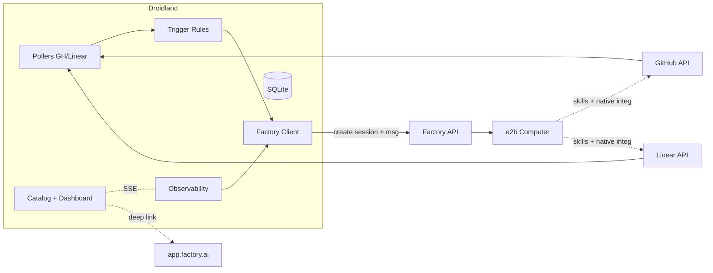
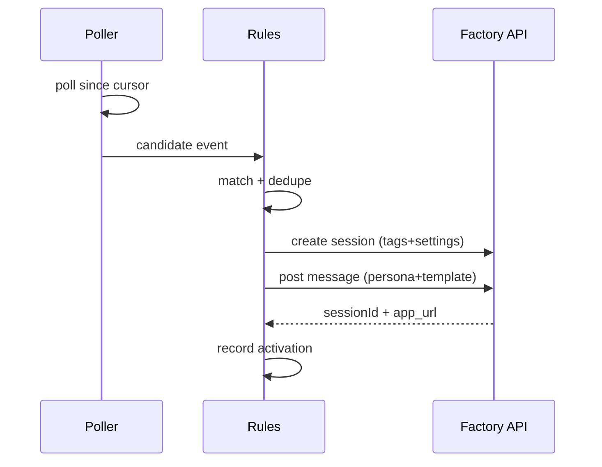

# Droidland - Spec & Progress

> Approved spec (2026-06-10). The "Implementation status" section at the end tracks what has
> been built so far. Keep it updated as work lands.

## Droidland - Spec (thin expert-orchestration layer)

A lightweight, Dockerized web app that does exactly three things and leans on app.factory.ai for everything else:
1. **Author & catalog "experts"** (droids with personas + declared skills/tools/integrations).
2. **Detect signals from GitHub & Linear by polling**, and route each matching signal to one expert (one expert per trigger).
3. **Observe** running experts and session health, with deep links into app.factory.ai.

Actual work (code review, reading Linear tickets, posting on PRs) is delegated to **Factory's native skills and Linear/GitHub integrations** running inside the expert's **Session on a shared managed (e2b) Droid Computer**. droidland reimplements none of that.

### Stack
- **Backend:** Python 3.12 + FastAPI + Uvicorn + `httpx` (Factory + GitHub + Linear clients). SQLite (stdlib) for droidland metadata.
- **Frontend:** React + Vite + TypeScript; dashboard live-refresh via SSE.
- **Runtime:** Docker + docker compose (thin image: Python + built frontend; no droid CLI/Playwright in container).
- **Secrets (env only):** `FACTORY_API_KEY` (orchestration + observability), `GITHUB_TOKEN` + `LINEAR_API_KEY` (read-only polling/detection).

### Architecture


### 1) Expert catalog
- An **expert** = `.factory/droids/<slug>.md`: front-matter (`model`, `autonomyLevel`, `interactionMode`, `enabledToolIds`/skills, `integrations` it relies on, `runInWorktree`, description) + body = persona system prompt. DB mirrors metadata; files are source of truth (CLI parity).
- **Authoring UI:** card catalog + markdown editor + settings form. On save, **validate** declared tools/skills against `droid --list-tools` output and surface declared integrations as preflight checks (warn if unavailable).
- **Prebuilt library:** `code-reviewer`, `pr-risk-analyzer`, `ticket-triager`, `implementor` (worktree), `test-writer` (worktree), `e2e-verifier` (Playwright on computer), `build-analyzer`.

### 2) Trigger layer (polling, no webhooks)
- **Connectors** poll on an interval with a persisted cursor: GitHub REST (PRs updated since cursor) and Linear GraphQL (issues whose labels/updatedAt changed). Read-only; detection only.
- **Trigger rule:** `(source, event_type, condition) -> expert + prompt_template + target(repo/cwd)`. Examples: GitHub `pull_request.opened` -> `code-reviewer`; Linear `issue.label == "implement"` -> `implementor`.
- **On match:** dedupe by `(external_ref, event)`; create a **tagged** Factory session (`droidland`, `expert:<slug>`, `trigger:<id>`, `ref:<pr|issue>`) on the shared computer with the expert's `sessionSettings`; post one message = persona prompt + rendered template (`{{ticket}}`, `{{pr}}`, `{{diff}}`, `{{repo}}`). The expert then acts via Factory's native integrations.
- **Guards:** ignore the bot's own activity (no self-trigger loops); rate-limit/backoff on GH/Linear; idempotent activations.



### 3) Observability
- Poll Factory **List sessions** filtered by the `droidland` tag + **Get session** for status/token usage/duration; **Get computer** + metrics for compute health. Cache in SQLite; push updates to UI via SSE.
- Dashboard shows: experts currently running, per-session status (idle/pending/running/failed), tokens/credits, recent activations, computer health, and **"Open in app.factory.ai"** deep links.

### Compute
- **One persistent shared e2b computer per target repo** (confirmed): `POST /computers {provider:"e2b", repos:[...], autoInstallDeps:true}`, poll to `active`, reused across activations, auto-pauses idle. Mutating experts use `runInWorktree:true`.

### Data model (SQLite)
- `experts(id, slug, name, description, model, autonomy, interaction_mode, skills_json, integrations_json, run_in_worktree, file_path)`
- `triggers(id, source, event_type, condition_json, expert_id, target_repo, cwd, prompt_template, enabled)`
- `connectors(id, source, config_json, cursor, last_polled_at, status)`
- `activations(id, trigger_id, expert_id, external_ref, factory_session_id, app_url, status, created_at)`
- `computers(id, factory_computer_id, target_repo, status)`
- `session_cache(factory_session_id, expert_slug, status, tokens_json, updated_at)`

### HTTP API
- `GET/POST/PUT /api/experts`, `POST /api/experts/validate`
- `GET/POST/PUT /api/triggers`, `POST /api/triggers/{id}/test` (fire with sample payload)
- `GET/POST /api/connectors` (configure + poll status)
- `GET /api/activations`, `GET /api/activations/{id}`
- `GET /api/sessions`, `GET /api/sessions/{id}` (observability, from cache + Factory)
- `GET/POST /api/computers`
- `GET /api/stream` (SSE dashboard updates)

### Frontend pages
- **Catalog:** browse/create/edit experts (cards, markdown editor, settings, validation badges).
- **Triggers:** map source+condition -> expert; enable/disable; connector config + last-poll status; "Test trigger".
- **Dashboard:** running experts, session health, token/credit usage, recent activations, computer health, deep links.

### Safety / autonomy
- Least-privilege `autonomyLevel` per expert (reviewers/triagers read-only); mutating experts isolated via `runInWorktree`; never auto-push to default branch.
- All secrets env-only; scrubbed from logs/SSE. Polling tokens are read-only and separate from the experts' Factory-native integration creds. Dedupe + bot-loop guards prevent runaway sessions.

### Repo layout
```
droidland/
  Dockerfile  docker-compose.yml  .dockerignore  .env.example
  backend/app/{main.py,api/,factory_client/,connectors/{github.py,linear.py},triggers/,db/,experts/}
  backend/{pyproject.toml,tests/}
  frontend/{src/,package.json,vite.config.ts}
  .factory/droids/*.md          # prebuilt experts
```

### Dogfooding bootstrap
- **Phase 0 - hand-built thin core:** Dockerfile/compose; Factory client + Sessions preflight; provision shared e2b computer with the droidland repo; SQLite schema; seed the prebuilt expert library; one working connector poll -> trigger match -> create session -> activation; dashboard reads. Success = a Linear ticket labeled `implement` (or a sample "Test trigger") spins up an expert session **visible in app.factory.ai**.
- **Phase 1+ - built BY droidland's experts:** label droidland's own Linear tickets `implement` to drive the `implementor` expert (plus `code-reviewer` on the resulting PRs) to build the catalog UI, triggers UI, dashboard, and remaining experts - each tracked as an activation with a session in app.factory.ai.

### Verification
- Backend: `pytest` for connectors (mocked GitHub/Linear), trigger matching + dedupe, and the Factory client (mocked). Frontend: `vitest`. E2E: the `e2e-verifier` expert runs Playwright on the computer against droidland and reports status. Lint: `ruff` + `eslint`. All via `docker compose`.

### Milestones
1. Phase 0 thin core: Factory client + preflight + shared computer + expert seed + single connector poll->session + dashboard read.
2. Full trigger layer: GitHub + Linear connectors, rule matching, dedupe, "Test trigger".
3. Expert catalog UI + authoring/validation.
4. Observability dashboard (sessions, tokens, computer health, deep links) with SSE.
5. Dogfood milestones 2-4 via droidland's own experts.

### Assumptions (editable)
- One expert per trigger (no multi-stage pipelines/gating in MVP).
- Polling-based detection for both GitHub and Linear (webhooks deferred to a prod phase).
- Persistent shared e2b computer per repo; experts declare skills/tools/integrations (validated best-effort).
- Sessions API confirmed enabled; single-user local tool (no auth/multi-tenant in MVP).
- The expert's real-world actions use Factory's native Linear/GitHub integrations + skills, not droidland-built logic.

---

## Implementation status

Legend: [x] done, [~] partial, [ ] not started.

### Milestones
- [~] **M1 - Phase 0 thin core.** Factory client, shared-computer manager, expert seeding, connector poll -> trigger match -> session activation, and dashboard reads are implemented and tested. Sessions "preflight" is not yet a dedicated check (deferred).
- [x] **M2 - Full trigger layer.** GitHub + Linear connectors, rule matching, dedupe, and "Test trigger" all work, plus a trigger-authoring UI (create/edit/enable/delete/test) and seeded default triggers (PR-opened -> code-reviewer, Linear `implement` -> implementor). Connectors still run from env config only; no per-connector config UI yet.
- [x] **M3 - Expert catalog UI + authoring.** Create/edit/delete experts via the UI, persisted to `.factory/droids/*.md` + DB with server-side validation. `validate` against `droid --list-tools` is still best-effort (checks slug/autonomy/mode + warns on integrations-without-skills); live tool-catalog validation remains a follow-up.
- [~] **M4 - Observability dashboard.** Session cache + SSE + activations dashboard with app.factory.ai deep links ship. Token/credit display and computer-health widgets are not surfaced in the UI yet.
- [ ] **M5 - Dogfood M2-M4 via droidland's own experts.**

### Component checklist
- [x] SQLite schema + data layer (`backend/app/db.py`).
- [x] Factory API client: computers, sessions, messages, list/interrupt (`factory_client.py`).
- [x] Expert loader from `.factory/droids/*.md` + DB sync (`experts.py`).
- [x] Prebuilt expert library (7 personas in `.factory/droids/`).
- [x] Connectors: GitHub PR polling, Linear issue polling, cursors (`connectors/`).
- [x] Trigger matching + `{{var}}` templating + dedupe + activation (`triggers.py`).
- [x] Background poller + observability loops (`poller.py`, `observability.py`).
- [x] FastAPI routes + SSE stream (`api/routes.py`, `main.py`).
- [x] Expert authoring: create/update/delete endpoints + markdown write-back + validation.
- [x] Expert editor UI (form + persona prompt) wired into the catalog.
- [x] Trigger authoring: create/update/delete + seed defaults; UI with enable/disable/test.
- [x] Backend tests (33 passing) + ruff clean.
- [x] Frontend tests: vitest on pure helpers (17 passing); `tsc --noEmit` + `vite build` green.
- [x] Frontend themed UI (catalog, triggers, dashboard).
- [x] Docker image + docker-compose + `.env.example`.

### Known gaps / next up
- Surface token/credit usage and Droid Computer health in the dashboard.
- Sessions API preflight check and connector configuration UI.
- Live tool-catalog validation (`droid --list-tools`) and `e2e-verifier` Playwright flow.

### Fixes landed post-Phase 0
- `List sessions` 400 fixed: the API has no `tag` query param; we now pass `limit`/`computerId`/`cursor` and filter by the `droidland` tag client-side (`observability.py`).
- UI theme: dark palette, gradient header, color-coded autonomy/source/status badges.
